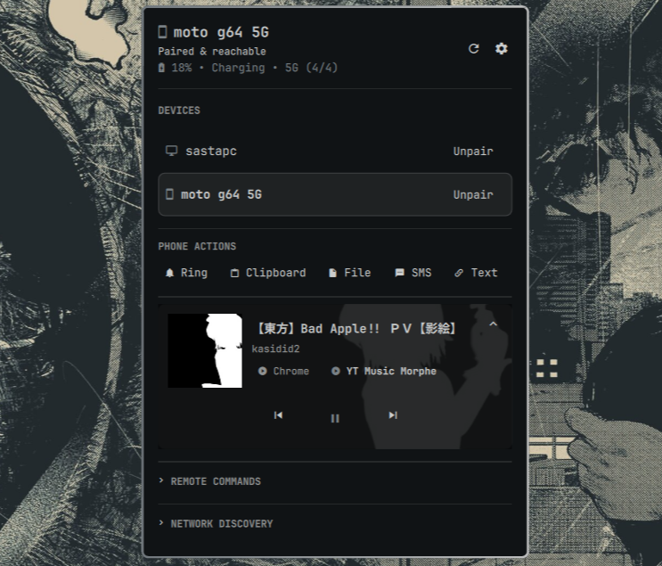
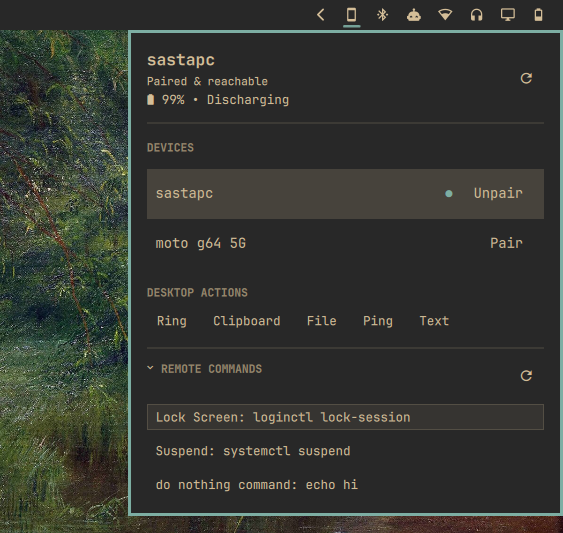

# OmaConnect

OmaConnect integrates KDE Connect device status, SMS messaging, battery/cellular monitoring, and remote actions seamlessly into the Omarchy bar.



## Install

```bash
omarchy plugin add https://github.com/jitendradara12/omaconnect.git --enable --yes
```

## Features

- **Device & Network Monitoring**: Real-time battery level, charging indicators, LTE/5G cellular status, reachability, and pairing state.
- **SMS & Messaging**: Direct `kdeconnect-sms` integration and inline ping/text composer.
- **Native Omarchy File Picker**: Send files to paired devices instantly via lightweight `omarchy-menu-select`, listing the most recently modified matches under `~/Downloads`, `~/Documents`, `~/Pictures`, and `~/Videos`.
- **Quick Device Actions**: Ring device, sync clipboard, send files, ping, and share text or URLs.
- **Remote Commands**: Discover and execute custom remote commands configured on target devices.
- **Pairing Management**: Inline pair and unpair requests with safety confirmation steps.
- **Vim & Keyboard Controls**: Full keyboard navigation (`h`/`j`/`k`/`l`), shortcuts, and IPC integration.
- **Performance Optimized**: Low-overhead QML process collector and memoized action bindings.

## Shortcuts

Add to `~/.config/omarchy/shortcuts.lua`:

```lua
o.bind("SUPER + SHIFT + C", "Toggle OmaConnect", "omarchy-shell shell toggle omaconnect")
```

### Panel Bindings

| Key                        | Action                                                     |
| :------------------------- | :--------------------------------------------------------- |
| `h`, `l` / `Left`, `Right` | Switch focus between Devices, Actions, and Remote Commands |
| `j`, `k` / `Down`, `Up`    | Navigate items within active section                       |
| `Enter`, `Space`           | Activate focused item or submit active composer            |
| `p`                        | Pair selected device                                       |
| `u`                        | Request unpair confirmation for selected device            |
| `y` / `c` (`Esc`)          | Confirm (`y`) or cancel (`c`/`Esc`) unpair prompt          |
| `r`                        | Refresh device status                                      |
| `Esc`                      | Close active composer or hide panel                        |

## Dependencies

Requires `kdeconnect`, `glib2`, `dbus`, and Omarchy's `omarchy-menu-select` command for file sharing:

```bash
sudo pacman -S kdeconnect glib2 dbus
```

### Firewall (UFW)

Omarchy blocks incoming ports by default. Allow KDE Connect discovery and transfer ports:



_You can just click **"Allow in Firewall"** directly inside the OmaConnect panel if no devices appear. Or you can do it manually..._

```bash
sudo ufw allow 1714:1764/tcp comment 'KDE Connect'
sudo ufw allow 1714:1764/udp comment 'KDE Connect'
sudo ufw reload
```

## Update

```bash
omarchy plugin update omaconnect
```

## Uninstall

```bash
omarchy plugin remove omaconnect
```
